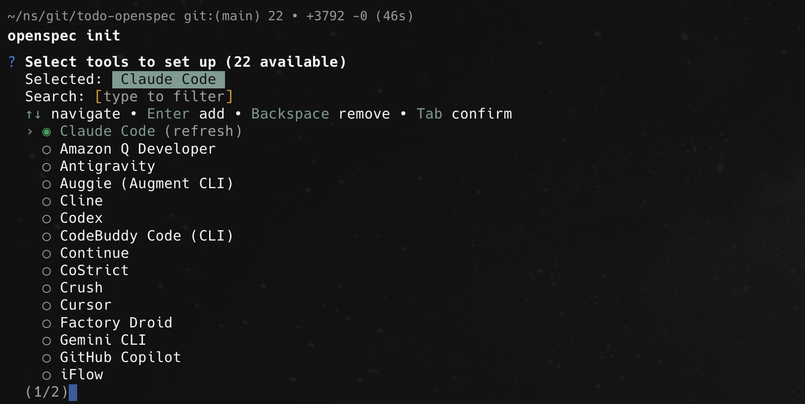
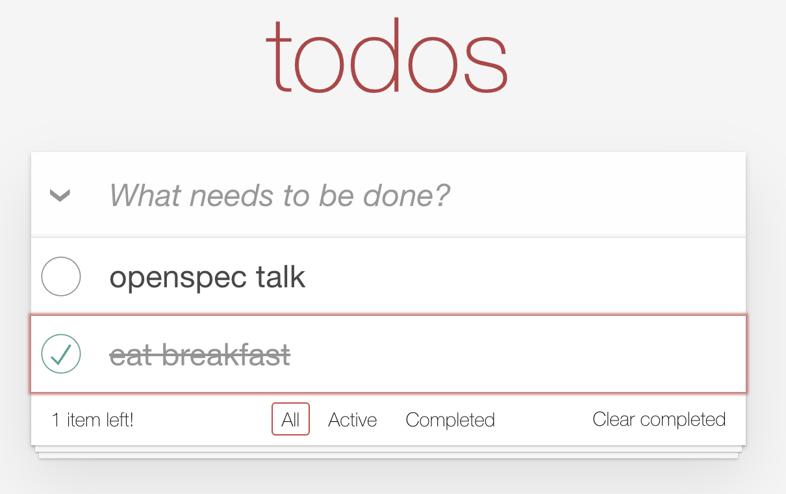
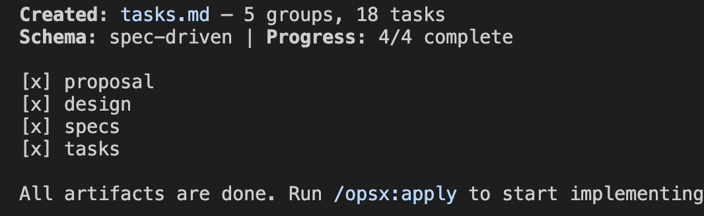
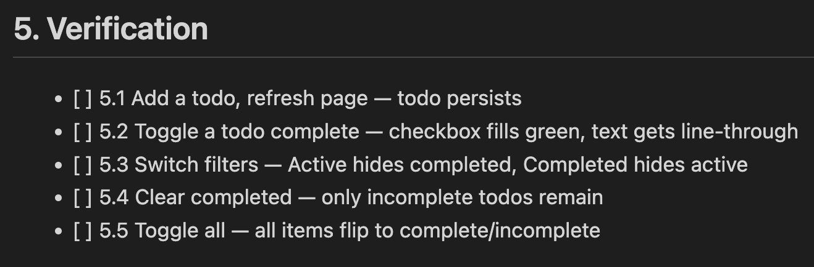

# Openspec Workshop
Todo List Demo

---

# Setup Openspec

```
npm install -g @fission-ai/openspec@latest

cd <project_directory>/
openspec init
```

* select claude


---

# Setup config.yaml
```
Update @openspec/config.yaml. The project uses vite, react, tailwind, typescript, zustand.
```

* `config.yaml` will always be loaded into **context window** (keep it short)

---

# Create your first spec

```
/opsx:new create a todo app for
demo purpose of openspec.
Use the style identical to [Image #1]
```



* screenshot from [TodoMVC-style](https://todomvc.com/examples/react/dist/)

---

# Check your `openspec/changes/todo-app`

---

# Run continue
```
/opsx:continue
```

---

# Run apply

```
/opsx:apply
```

<!-- ---

# Run verify


After manual check, run:
```
/opsx:verify
``` -->

---

# Run archive

When changes are done, run:

```
/opsx:archive
```

---

# Discussions

---

# Model

* Opus: Planning
* Sonnet: Implementation

---

# Design Doc

* Detailed, fine-grained description on confluence
* [Component Example](https://netskope.atlassian.net/wiki/spaces/Reporting/pages/6466011875/Design+Doc+for+Reporting+Overview+Page#Tab-Switch-Area)
* [API Example](https://netskope.atlassian.net/wiki/spaces/Reporting/pages/6466011875/Design+Doc+for+Reporting+Overview+Page#API-Design)

---

# Source of Truth
* before: source code
* now: spec files

---

# QA